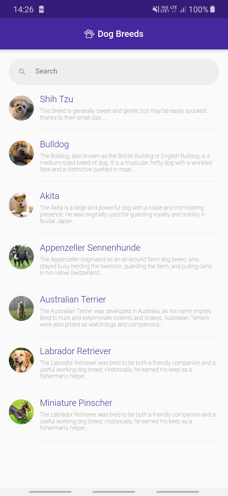
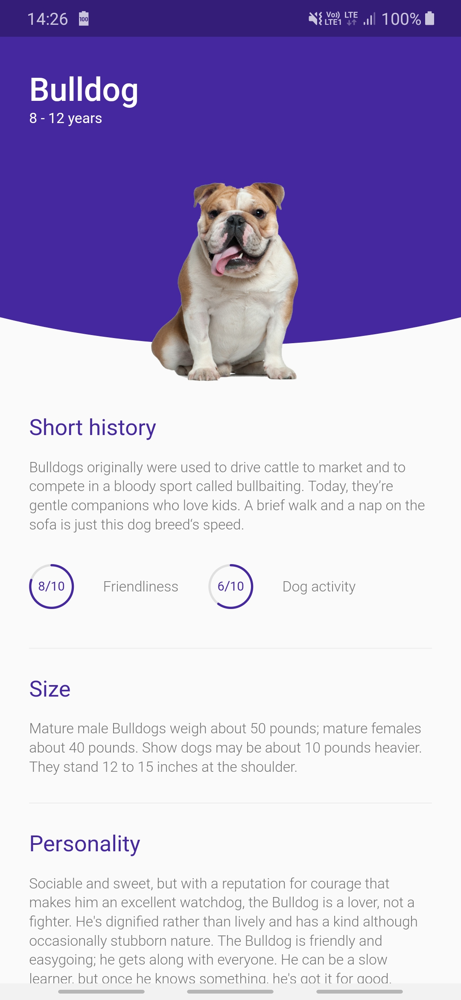

<a name="readme-top"></a>


<!-- PROJECT LOGO -->
<br />
<div align="center">
  
  <h3 align="center">Dog-App</h3>
  <p align="center">
    This is a Flutter app that displays a list of 
    <br />dog breeds, allows users to search and view
    <br />detailed information about each breed.
    <br /><br />
  </p>
</div>


<!-- TABLE OF CONTENTS -->
<details>
  <summary>Table of Contents</summary>
  <ol>
    <li>
      <a href="#about-the-project">About The Project</a>
      <ul>
        <li><a href="#built-with">Built With</a></li>
      </ul>
    </li>
    <li>
      <a href="#getting-started">Getting Started</a>
      <ul>
        <li><a href="#installation">Installation</a></li>
      </ul>
    </li>
    <li><a href="#usage">Usage</a></li>
    <li><a href="#license">License</a></li>
    <li><a href="#acknowledgments">Acknowledgments</a></li>
  </ol>
</details>


<!-- ABOUT THE PROJECT -->
## About The Project

This is a Flutter app that allows users to browse a list of dog breeds and search for specific breeds. Upon selecting a breed, the app displays comprehensive information about the breed's personality, friendliness, size, activity level, and other relevant details. This app was originally developed as a side project during my BSc degree studies in IT engineering.

<p align="right">(<a href="#readme-top">back to top</a>)</p>


### Built With

![Flutter][Flutter-url]
![Dart][Dart-url]

<p align="right">(<a href="#readme-top">back to top</a>)</p>


<!-- GETTING STARTED -->
## Getting Started

To get a local copy up and running follow these simple steps.

### Installation

1. Clone the repo
   ```sh
   git clone git@github.com:kamillobinski/dog-app.git
   ```

2. Open the cloned repository in Android Studio or any other code editor
   ```sh
   docker compose -f docker-compose-dev.yml up -d
   ```

3. Install the necessary dependencies by running the following command in the terminal
   ```sh
   flutter pub get
   ```

4. Once the dependencies are installed, you can run the app on an emulator or a physical device using the following command
   ```
   flutter run
   ```

<p align="right">(<a href="#readme-top">back to top</a>)</p>


<!-- USAGE -->
## Usage

Here are some previews of the app's main features:

| All | Homepage | BreedPage |
|   ---  |  ---  |  ---  |
|   | View a list of dog breeds <br/> |  | 

<p align="right">(<a href="#readme-top">back to top</a>)</p>


<!-- LICENSE -->
## License

Distributed under the Apache 2.0 License. See `LICENSE` for more information.

<p align="right">(<a href="#readme-top">back to top</a>)</p>


<!-- MARKDOWN LINKS & IMAGES -->
[Flutter-url]: https://img.shields.io/badge/Flutter-%2302569B.svg?style=for-the-badge&logo=Flutter&logoColor=white
[Dart-url]: https://img.shields.io/badge/dart-%230175C2.svg?style=for-the-badge&logo=dart&logoColor=white